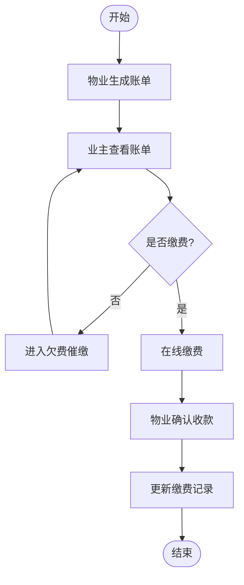
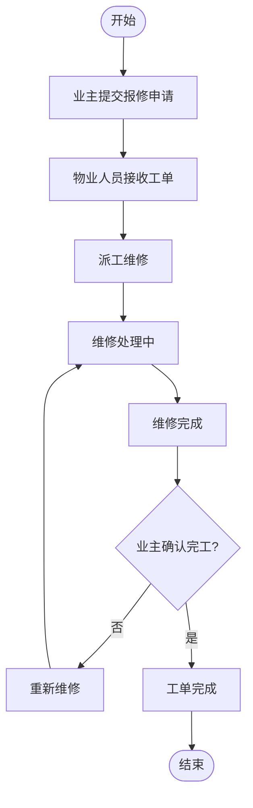

# CPMS 图表 Mermaid 代码

## 1. 系统功能思维导图

```mermaid
mindmap
  root((社区物业管理系统 (CPMS)))
    %% 系统概述
    概述
      背景
        传统的纸质管理效率低
        信息传递不及时
      目标
        数字化、规范化
        提高效率与服务质量
      可行性分析
        技术: Vue3+Spring Boot+MySQL (低风险)
        经济: 开源技术 (成本低)
        操作: B/S 架构, 界面友好

    %% 用户角色
    用户角色
      系统管理员 (admin)
        最高权限
        系统维护, 用户管理
      物业人员 (staff)
        日常运营操作
      业主 (owner)
        社区住户
        查看信息, 提交申请

    %% 功能需求 (核心)
    功能模块
      1. 用户与权限管理
        登录/登出
        注册(业主)
        账号管理(增删改查, 管理员)
        个人信息/密码修改
      2. 房产信息管理
        三级管理(楼栋->单元->房间)
        房产与业主绑定
      3. 业主信息管理
        档案登记
        家庭成员
        入住/迁出
        联系方式
      4. 物业费用管理
        项目设置
        账单生成
        缴费登记
        欠费催缴
        业主个人查询
      5. 报修管理
        业主提交
        物业接单/派工
        进度跟踪
        业主完工确认
      6. 投诉与建议
        业主提交(支持匿名)
        物业回复/处理
        结果反馈
      7. 公告通知
        物业发布
        所有用户查看(列表/详情)
        删除/下架(发布者/管理员)
      8. 停车位管理
        车位信息(增删改查)
        车辆登记
        车位绑定(一对一)
        使用记录查询

    %% 非功能需求
    非功能需求
      性能
        响应时间 ≤ 2秒
        50 并发访问
      安全性
        密码加密
        SQL 注入防护
        权限访问控制
        输入校验
      可用性
        界面简洁
        流程符合实际
      可维护性
        前后端分离
        代码结构清晰
      兼容性
        主流浏览器最新版
```

## 2. 物业缴费流程图



## 3. 报修管理流程图


