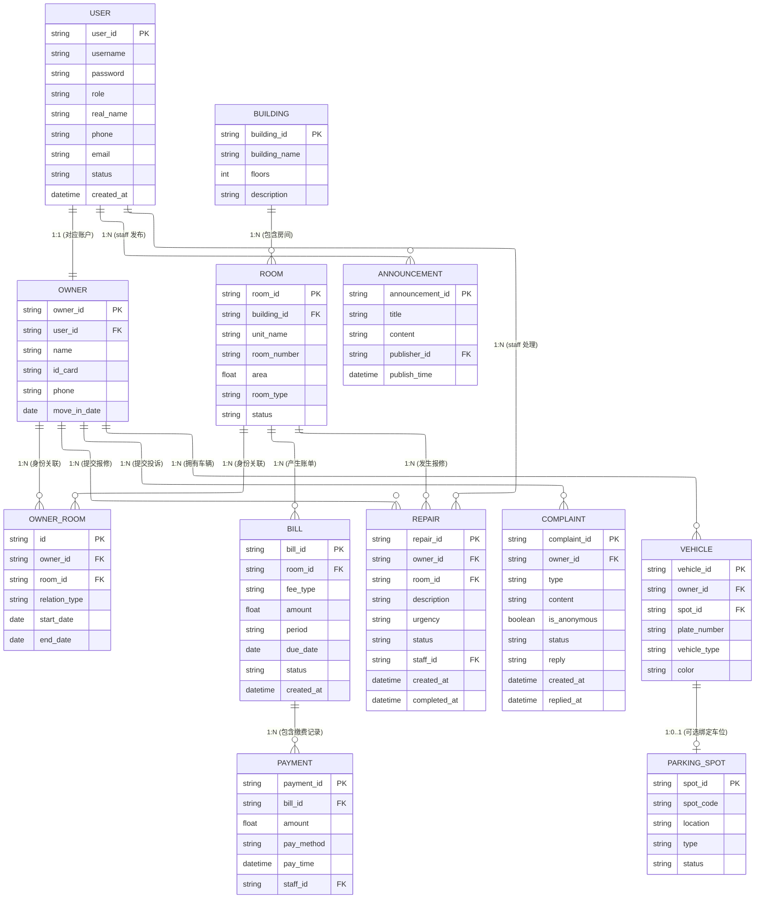

# ER 图 Mermaid 代码（最终版）

```mermaid
---
config:
  layout: elk
---
erDiagram
    direction TB
    USER {
        string user_id PK ""  
        string username  ""  
        string password  ""  
        string role  ""  
        string real_name  ""  
        string phone  ""  
        string email  ""  
        string status  ""  
        datetime created_at  ""  
    }

    OWNER {
        string owner_id PK ""  
        string user_id FK ""  
        string name  ""  
        string id_card  ""  
        string phone  ""  
        date move_in_date  ""  
    }

    OWNER_ROOM {
        string id PK ""  
        string owner_id FK ""  
        string room_id FK ""  
        string relation_type  ""  
        date start_date  ""  
        date end_date  ""  
    }

    BUILDING {
        string building_id PK ""  
        string building_name  ""  
        int floors  ""  
        string description  ""  
    }

    ROOM {
        string room_id PK ""  
        string building_id FK ""  
        string unit_name  ""  
        string room_number  ""  
        float area  ""  
        string room_type  ""  
        string status  ""  
    }

    BILL {
        string bill_id PK ""  
        string room_id FK ""  
        string fee_type  ""  
        float amount  ""  
        string period  ""  
        date due_date  ""  
        string status  ""  
        datetime created_at  ""  
    }

    PAYMENT {
        string payment_id PK ""  
        string bill_id FK ""  
        float amount  ""  
        string pay_method  ""  
        datetime pay_time  ""  
        string staff_id FK ""  
    }

    REPAIR {
        string repair_id PK ""  
        string owner_id FK ""  
        string room_id FK ""  
        string description  ""  
        string urgency  ""  
        string status  ""  
        string staff_id FK ""  
        datetime created_at  ""  
        datetime completed_at  ""  
    }

    COMPLAINT {
        string complaint_id PK ""  
        string owner_id FK ""  
        string type  ""  
        string content  ""  
        boolean is_anonymous  ""  
        string status  ""  
        string reply  ""  
        datetime created_at  ""  
        datetime replied_at  ""  
    }

    ANNOUNCEMENT {
        string announcement_id PK ""  
        string title  ""  
        string content  ""  
        string publisher_id FK ""  
        datetime publish_time  ""  
    }

    PARKING_SPOT {
        string spot_id PK ""  
        string spot_code  ""  
        string location  ""  
        string type  ""  
        string status  ""  
    }

    VEHICLE {
        string vehicle_id PK ""  
        string owner_id FK ""  
        string spot_id FK ""  
        string plate_number  ""  
        string vehicle_type  ""  
        string color  ""  
    }

    USER||--||OWNER:"1:1 (对应账户)"
    USER||--o{REPAIR:"1:N (staff 处理)"
    USER||--o{ANNOUNCEMENT:"1:N (staff 发布)"
    OWNER||--o{REPAIR:"1:N (提交报修)"
    OWNER||--o{COMPLAINT:"1:N (提交投诉)"
    OWNER||--o{VEHICLE:"1:N (拥有车辆)"
    OWNER||--o{OWNER_ROOM:"1:N (身份关联)"
    ROOM||--o{OWNER_ROOM:"1:N (身份关联)"
    BUILDING||--o{ROOM:"1:N (包含房间)"
    ROOM||--o{REPAIR:"1:N (发生报修)"
    ROOM||--o{BILL:"1:N (产生账单)"
    BILL||--o{PAYMENT:"1:N (包含缴费记录)"
    VEHICLE||--o|PARKING_SPOT:"1:0..1 (可选绑定车位)"
```
